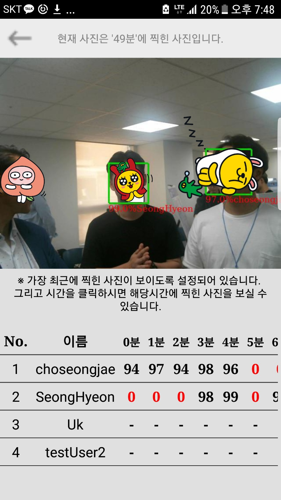

# ChungmuroClass2
This is Android source code

Server source code is in 
https://github.com/HoYoung1/Chungmuroclass

------------------------------------------------------------------------------------------------------------------------------------------
2018-1 동국대 캡스톤디자인 프로젝트

프로젝트명 : 얼굴 인식을 통한 자동출석체크 시스템
사용대상 : 학생
소프트웨어 : 안드로이드
설명 : 사용자(학생)들은 O,X 표시와 시간대별 찍힌 사진을 확인하여 본인의 출석체크가 정상적으로 처리되었는지 확인 가능

